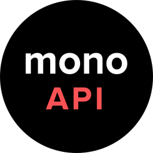
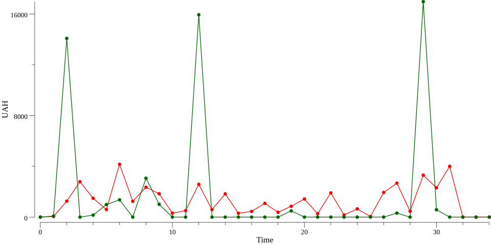

# MonoBank SDK

[godoc]: https://godoc.org/github.com/shal/mono
[godoc-img]: https://godoc.org/github.com/shal/mono?status.svg

[ci]: https://circleci.com/gh/shal/mono
[ci-img]: https://circleci.com/gh/shal/mono.svg?style=svg

[goreport]: https://goreportcard.com/report/github.com/shal/mono
[goreport-img]: https://goreportcard.com/badge/github.com/shal/mono

[version]: https://img.shields.io/github/v/tag/shal/mono?sort=semver

[![Circle CI][ci-img]][ci]
[![Docs][godoc-img]][godoc]
[![Go Report][goreport-img]][goreport]
[![Version][version]][version]

:bank: Golang client for [Mono API](https://api.monobank.ua/docs/).



You can find documentation for all types of API [here](./docs).

1. [Introduction](#introduction)
2. [Documentation](#documentation)
3. [Using library](#use)
4. [Example](#example)
5. [Contributions](#contributions)

## Introduction

Read access APIs for monobank app.

Please, use personal API only in non-commersial services.

If you have a service or application and you want to centrally join the API for customer service, you need to connect to a corporate API that has more features.

This will allow monobank clients to log in to your service (for example, in a financial manager) to provide information about the status of an account or statements.

## Documentation

### PUBLIC API

Find dedicated doc for usage of personal API [here](./docs/public.md)

### PERSONAL API

Find dedicated doc for usage of personal API [here](./docs/personal.md)

### CORPORATE API

Find dedicated doc for usage of corporate API [here](./docs/corporate.md)

## Use

This package has no dependencies, install it with command below

```sh
go get github.com/shal/mono
```

You can take a look and inspire by following [examples](./examples)

## Example

```go
package main

import (
    "fmt"
    "os"
    "time"

    "github.com/shal/mono"
)

func main() {
    personal := mono.NewPersonal("token ")

    user, err := personal.User()
    if err != nil {
        fmt.Println(err.Error())
        os.Exit(1)
    }

    from := time.Now().Add(-730 * time.Hour)
    to := time.Now()

    var account mono.Account

    for _, acc := range user.Accounts {
        ccy, _ := mono.CurrencyFromISO4217(acc.CurrencyCode)
        if ccy.Code == "UAH" {
            account = acc
        }
    }

    transactions, err := personal.Transactions(account.ID, from, to)
    if err != nil {
        fmt.Println(err.Error())
        os.Exit(1)
    }

    fmt.Printf("Account: %s\n", account.ID)

    fmt.Println("Transactions:")
    for _, transaction := range transactions {
        fmt.Printf("%d\t%s\n", transaction.Amount, transaction.Description)
    }
}
```

More about this example [here](./examples/personal/main.go).



## Contributions

You can send me some tips to [MonoBank](https://send.monobank.com.ua/2FVYpRHoi), if this package was useful.

## License

Project released under the terms of the MIT [license](./LICENSE).
